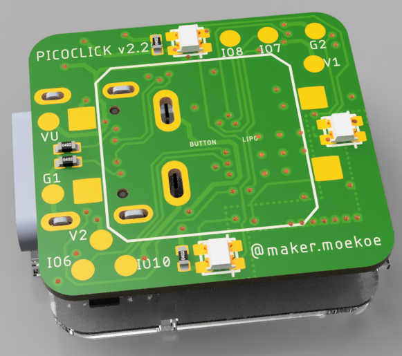

# Picoclick

<a href="https://www.instagram.com/p/CEPDfjlKE4K/?utm_source=ig_web_button_share_sheet"></a>

(Click on the image for a small video.)

People who follow my Instagram already knew what I have worked on several months now with tons of PCB iterations... But now it's done!
The Picoclick is a simple IOT-Button in a very small package. The dimensions of the PCB are only 18x20mm and the height with a 300909 battery is only about 10mm. It is able to connect to your local WiFi at an amazingly high speed of about 1.5 seconds in average. Yes, as it calls IOT-Button, it uses WiFi of course! That enables tons of possibilities for that little device. The original idea behind it was to control my local lights, outlets and radiators in my smart home through a single button press - or two, or a button hold, ... As the Picoclick **doesn't use deepsleep** it enables many possible button combinations, because the button isn't connected to the reset line of the MCU, like it is mainly done on such devices (even on my own old dashbuttons...). Nevertheless, the Picoclick can be used somewhere else of course! I have successfully integrated it into MQTT and IFTTT, but it can be used to control everything which has at least a WiFi connection. Additionally it has four external GPIOs which can be used to control things and read sensors for other projects. BTW. the Picoclick can be flashed with that sexy USB-C jack, because it has an onboard CP2102N USB-Serial bridge.

Here are some specs of the Picoclick:
- “Pico” size: 18.0×20.0mm board outline
- Single button interface
- Three WS2812 LEDs for visual feedback
- ESP8285 MCU board (behaves like the ESP8266, just a little less memory)
- Four external GPIOs (as solder pads)
- Fully integrated LiPo charging solution with a great protection circuit (including Over(dis)charge, reverse polarity, short circuit protection and more)
- Charging and programming via the USB Type-C jack (integrated CP2102N USB-Serial bridge)
- A 30mAh (9x9x3mm pouch cell) battery is enough to reaches over 350 clicks.
- Ultra low stand-by current

</a>

</a>

</a>

For battery info, check my [website](https://makermoekoe.com/2020/12/08/picoclick/).


## GPIOs

Function | GPIO | Mode
-------- | -------- | --------
WS2812 Din | GPIO14   | Output
Button | GPIO12   | Input
Latch* | GPIO13   | Output
Charge Stat. | GPIO4  | Input
Ext IO1  |  GPIO6   | IO
Ext IO2  |  GPIO7   | IO
Ext IO3  |  GPIO8   | IO
Ext IO4  |  GPIO10  | IO

*The Picoclick doesn't use the deepsleep functionality of the MCU, because it uses too much power. It comes with its own power latching circuit. The MCU can control its own power with the latch pin. Once it is held high the ESP8285 will get power and as soon as it is pulled low the ESP8285 will shut down. Easy peasy...

## Circuit

The circuit is based on the following components:
- MCU ESP8285 with external 24MHz oscillator and external Rainsun AN2051 chip antenna
- CP2102N USB-Serial bridge with autoreset circuit based on the MUN5214DW1T1G dual transistor
- RT9193 3,3v voltage regulator
- LiPo charger BRCL4054BME (MCP73831 alternative, pin compatible)
- XB5353A LiPo protection with SEU7401U reverse polarity protection; power measurement via voltage divider
- power latching circuit based on 4148 SOD523 diodes
- WS2812 2020 mini RGB LEDs

## Code

You can just run every code that you have in your mind, just make sure that the Picoclick needs to be powered in one of the following two ways:
- button press
- latching pin

So please keep in mind that it will shut down if you release the button and doesn't pull the latch pin high. Typically you have to call following two lines of code at first.
```
pinMode(latch,OUTPUT);
digitalWrite(latch,HIGH);
```
To turn the Picoclick off, you have to call:
```
digitalWrite(latch,LOW);
```

The charge status GPIO can be used to read the state of the onboard LiPo charger. Use the following code first to enable this feature:
```
pinMode(status_charger,INPUT_PULLUP);
int status = digitalRead(status_charger);
```
Where ```status_charger```is the GPIO4. The ```status```variable will hold the status. It returns 0 when the battery is charging through the USB port. It returns 1 if the battery is fully charged.

### Fast WiFi connection
To enable a really fast WiFi connection you have to put your local access point into a fixed WiFi channel. In doing so, the Picoclick is able to know that channel which saves around a second while connecting to the AP. Another thing is the BSSID, which can be found on your access points settings. Just enter your local IP into your favorite internet browser and find that terrifying number somewhere. Add that settings to the following lines of code:

```
const uint8_t bssid[6] = {0x80, 0x71, 0x7A, 0x3F, 0x8B, 0x63}; //put your access points bssid here
const int wifi_channel = 9; //set the channel in your access points settings
```

I have attached three simple examples in the code folder of this repo. A bare_minimum sketch with just a simple led animation, an mqtt example and an IFTTT example.

Update 13.12.2020: I have added the buttonpress_counter.cpp for interrupt counting the button presses. This can be used for several application. Next is to add the button hold functionality, but that shouldn't be a problem.

## Uploading code with PlatformIO

Before starting: The Picoclick has to be connected to an external power supply via those pads on the bottom of the PCB. They are labeled as + and -. The voltage should be between 3.5 volts and 6 volts. Without power supply, the Picoclick won't be recognized by your computer.

As my favorite IDE is PlatformIO I will show you an easy way on how to setup your Picoclick there. Nevertheless all this is possible in the Arduino IDE as well.

PlatformIO has the great advantage that it has plenty of boards available in the base version. So you don't have to install the ESP8266 board separately, like it is done in the Arduino IDE.
Actually, PlatformIO is just a plugin for VisualStudio Code which can be downloaded here: https://platformio.org/install/ide?install=vscode
Inside the VSCode you can install the plugin afterwards. The link has a great and detailed description on how to proceed.

Once you have everything installed correctly, you should see the PIO Home screen after restarting VSCode. Now you can open an existing project or just create a new one. When creating a new one then select the following options:
- Name: Picoclick (just a name)
- Board: Generic ESP8285 Module (Espressif) (you can just search for esp8285, because searching it manually would take an hour...)
- Framework: Arduino (default)

Afterwards you got a new project in your workspace which contains two important files. The ```main.cpp``` and the ```platform.ini```. The ```main.cpp``` file contains the code (which you can found in this repo) and the ```platform.ini``` file contains informations about the board, usb upload port, monitor speed and everything which you could possibly set. The minimum platform.ini file should look like this for all the Picoclick sketches:
```
[env:esp8285]
platform = espressif8266
board = esp8285
framework = arduino

upload_speed = 460800
upload_port = /dev/cu.usbserial-1410
monitor_speed = 115200
upload_resetmethod = nodemcu
```
The only thing you have to change is the ```upload_port```. You can spot the right one in your PIO Home screen in the Devices tab. Once you're done you can perform several actions in the bottom left corner of VSCode: compile, upload, serial monitor, ...

While uploading a sketch to the Picoclick you have to press and hold the button of it during the complete uploading process. It should automatically reboot and start your code. The button can be released afterwards.

## External GPIO's
The Picoclick has four external GPIO's (GPIO6, GPIO7, GPIO8, GPIO10) which are labeled as IO's. These can be both inputs or outputs. The other pads on the top side of the Picoclick (button side) are power supply pads, which can be used like this:

Label | Description
-------- | --------
VU | USB voltage (5 volt)
V1 | 3.3 volt
V2 | 3.3 volt
G1 | GND
G2 | GND

An overview of the external pads is given below.

</a>

Have fun! :)
